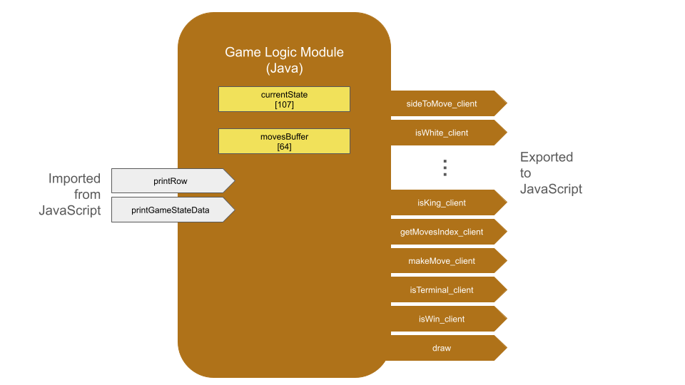
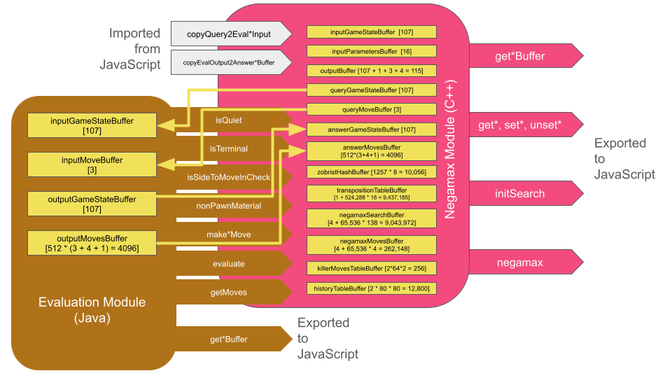

# [Omega Chess](https://www.ericjoycefilm.com/wastesoftime/boardgames/omegachess/index.php?lang=en)
Notes on the creation of Omega Chess

## Docker container to compile Java to WebAssembly
We wish to have means to compile Java code into WebAssembly modules that handle game-compute on the front-end. Since this is a specialized, project-specific use-case, I do not want to modify my system's usual toolchains. 

Therefore, create a Docker container to compile WebAssembly modules. Leave the rest of my system alone.
```
sudo docker build -t java-wasm .
```

Confirm its existence.
```
sudo docker images
```

When you choose to, kill the container.
```
sudo docker image rm java-wasm
```

## Zobrist hash generator
This executable (not a WebAssembly module) lives on the server back-end. Compile using GCC. Call it when the page loads to generate a random Zobrist hash for every game.
```
gcc -Wall zgenerate.c -lm -o zgenerate
```

## Opening-book Zobrist hasher
Unlike the in-game hasher, this one is *not* randomly generated for each session.

This executable (not a WebAssembly module) lives on the server back-end. Compile using GCC. Call it from the PHP lookup script.
```
g++ -Wall hash.cpp -lm -o hash
```

For example:
```
./hash 236 4 4 3 6 2 5 7 8 5 2 6 3 1 1 1 1 1 1 1 1 1 1 0 0 0 0 0 0 0 0 0 0 0 0 0 0 0 0 0 0 0 0 0 0 0 0 0 0 0 0 0 0 0 0 0 0 0 0 0 0 0 0 0 0 0 0 0 0 0 0 0 0 0 0 0 0 0 0 0 0 0 0 9 9 9 9 9 9 9 9 9 9 11 14 10 13 15 16 13 10 14 11 12 12 0 0
```

should produce
```
17550633337094085620
```

To look this position up in the opening book, call:
```
./lookup 17550633337094085620 236 4 4 3 6 2 5 7 8 5 2 6 3 1 1 1 1 1 1 1 1 1 1 0 0 0 0 0 0 0 0 0 0 0 0 0 0 0 0 0 0 0 0 0 0 0 0 0 0 0 0 0 0 0 0 0 0 0 0 0 0 0 0 0 0 0 0 0 0 0 0 0 0 0 0 0 0 0 0 0 0 0 0 9 9 9 9 9 9 9 9 9 9 11 14 10 13 15 16 13 10 14 11 12 12 0 0
```

which produces, for example,
```
SUCCESS,6,21,0
```

which is the one of four moves on file for this state.

## Constants for the Omega Chess engine

| Name  | Value  | Description |
| :---:	| :----: | :---------: |
| _GAMESTATE_BYTE_SIZE | 107 | Number of bytes needed to encode a game state |
| _MOVE_BYTE_SIZE | 3 | Number of bytes needed to describe a move in Omega Chess |
| _MAX_NUM_TARGETS | 64 | A (generous) upper bound on how many distinct destinations (not distinct moves) may be available to a player from a single index |
| _MAX_MOVES | 512 | A (generous) upper bound on how many moves may be made by a team in a single turn |
| _PARAMETER_ARRAY_SIZE | 16 | Encodes values that are written to and read from the the search process |
| _KILLER_MOVE_PER_PLY | 2 | Chess engines typically store 2 killer moves per ply |
| _KILLER_MOVE_MAX_DEPTH | 64 | Not to say that we actually search to depth 64! This is just comfortably large. |
| _TRANSPO_RECORD_BYTE_SIZE | 18 | Number of bytes needed to store a TranspoRecord object |
| _TRANSPO_TABLE_SIZE | 524288 | Number of TranspoRecords, each 18 bytes |
| _TREE_SEARCH_ARRAY_SIZE | 65536 | Number of (game-state bytes, move-bytes) |
| _NEGAMAX_NODE_BYTE_SIZE | ??? | Number of bytes needed to encode a negamax node |
| _NEGAMAX_MOVE_BYTE_SIZE | 4 | Number of bytes needed to encode a negamax move (in their separate, global array) |
| ZHASH_TABLE_SIZE | ??? | Number of Zobrist keys |
| _WHITE_TO_MOVE | 0 | Indication that white is to move in the current game state |
| _BLACK_TO_MOVE | 1 | Indication that black is to move in the current game state |

## Client-facing game logic module

### Game-Logic Module



The **game-logic module** has *two* outward-facing buffers:
- `currentState` is `_GAMESTATE_BYTE_SIZE` bytes long. It encodes the current state of the game.
- `movesBuffer` is `_MAX_NUM_TARGETS` bytes long.

Compile the front-end, client-facing game-logic module. This WebAssembly module answers queries from the client-side like getting data about which pieces can move where.
```
sudo docker run --rm -v "$PWD":/project -v "$HOME/.m2":/root/.m2 java-wasm clean package
```

This single call produces everything we'll need for this project.

```
target/
 +---classes/
 |    +---org/
 |         +---omegachess/
 |              +---cli/
 |              |    +---GameLogicCli.class
 |              +---core/
 |              |    +---features/
 |              |    |    +---FeatureEncoding.class
 |              |    |    +---FeatureScratch.class
 |              |    |    +---FeatureSpec.class
 |              |    |    +---TacticalAnalyzer.class
 |              |    +---GameEncoding.class
 |              |    +---GameLogic.class
 |              |    +---GameState.class
 |              |    +---Move.class
 |              +---eval/
 |              |    +---HeuristicEvaluator.class
 |              |    +---PaganEvaluationWasm.class
 |              |    +---PaganEvaluator.class
 |              |    +---PaganNetwork.class
 |              |    +---PaganSpec.class
 |              |    +---PaganWeights.class
 |              +---wasm/
 |                   +---GameLogicWasm.class
 +---generated/
 |    +---wasm/
 |         +---gamelogic-wasm-runtime.js
 |         +---eval-wasm-runtime.js
 |         +---teavm/
 |              +---gamelogic.wasm
 |              +---eval.wasm
 +---generated-sources/
 |    +---annotations/
 +---maven-archiver/
 |    +---pom.properties
 +---maven-status/
 |    +---maven-compiler-plugin/
 |         +---compile/
 |              +---default-compile/
 |                   +---createdFiles.lst
 |                   +---inputFiles.lst
 +---omega-chess-cli.jar
```




## Citation
If this code was helpful to you, please cite this repository.

```
@misc{omegachess,
  title={Omega Chess in Java},
  author={Eric C. Joyce},
  year={2025},
  publisher={Github},
  journal={GitHub repository},
  howpublished={\url{https://github.com/EricCJoyce/Omega-Chess}}
}
```
